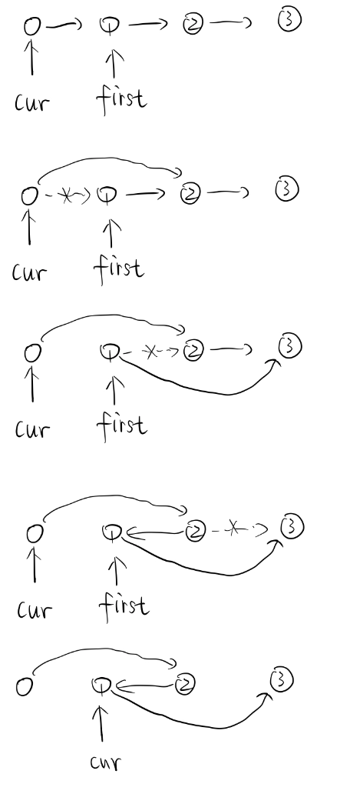

### Q21-Q30

#### 21. Merge Two Sorted Lists

> Merge two sorted linked lists and return it as a new list. The new list should be made by splicing together the nodes of the first two lists.
>
> **Example:**
>
> ```
> Input: 1->2->4, 1->3->4
> Output: 1->1->2->3->4->4
> ```

```c++
ListNode* mergeTwoLists(ListNode* l1, ListNode* l2) {
        ListNode *dummy = new ListNode(0);
        ListNode *p = dummy;
        while(l1 && l2){
            if(l1->val < l2->val){
                p ->next = l1;
                l1 = l1->next;
            }else{
                p ->next = l2;
                l2 = l2->next;
            }
            p = p->next;
        }
        p ->next = (l1)?(l1):(l2);
        return dummy->next;
    }
```

Use dummy head.

#### 22. Generate Parentheses

> Given *n* pairs of parentheses, write a function to generate all combinations of well-formed parentheses.
>
> For example, given *n* = 3, a solution set is:
>
> ```
> [
>   "((()))",
>   "(()())",
>   "(())()",
>   "()(())",
>   "()()()"
> ]
> ```

```c++
vector<string> generateParenthesis(int n) {
        vector<string> ans;
        dfs(n, n, ans, "");
        return ans;
    }
    void dfs(int left, int right, vector<string>& ans, string selected){
        if(left == 0 && right == 0){
            ans.push_back(selected);
            return;
        }
        if(left > 0)
            dfs(left-1, right, ans, selected + '(');
        if(right > left)
            dfs(left, right-1, ans, selected + ')');
    }
```

DFS. 

Note: ')))(((' is not allowed.

#### 23. Merge k Sorted Lists

> Merge *k* sorted linked lists and return it as one sorted list. Analyze and describe its complexity.
>
> **Example:**
>
> ```
> Input:
> [
>   1->4->5,
>   1->3->4,
>   2->6
> ]
> Output: 1->1->2->3->4->4->5->6
> ```

```c++
	struct cmp{
        bool operator()(const ListNode* x, const ListNode *y){
            return x->val > y->val;
        }
    };
    ListNode* mergeKLists(vector<ListNode*>& lists) {
        priority_queue<ListNode*,vector<ListNode*>,cmp> pq;
        for(auto head:lists){
            if(head) pq.push(head);
        }
        ListNode *dummy = new ListNode(0);
        ListNode *p = dummy;
        while(!pq.empty()){
            auto cur = pq.top();pq.pop();
            p->next = cur;
            p = p->next;
            if(cur->next){
                pq.push(cur->next);
            }
        }
        return dummy->next;
    }
```

Scan vertically using priority_queue. O(Nlogk) N:total nodes, k: len(lists)

#### 24. Swap Nodes in Pairs

> Given a linked list, swap every two adjacent nodes and return its head.
>
> You may **not** modify the values in the list's nodes, only nodes itself may be changed.
>
>  
>
> **Example:**
>
> ```
> Given 1->2->3->4, you should return the list as 2->1->4->3.
> ```

```c++
ListNode* swapPairs(ListNode* head) {
        ListNode* dummy = new ListNode(0);
        dummy->next = head;
        ListNode* cur = dummy;
        while(cur->next && cur->next->next){
            ListNode *first = cur->next;
            cur->next = first->next;
            first->next = first->next->next;
            cur->next->next = first;
            cur = first;
        }
        return dummy->next;
    }
```




#### 25. Reverse Nodes in k-Group

> Given a linked list, reverse the nodes of a linked list *k* at a time and return its modified list.
>
> *k* is a positive integer and is less than or equal to the length of the linked list. If the number of nodes is not a multiple of *k* then left-out nodes in the end should remain as it is.
>
> 
>
> **Example:**
>
> Given this linked list: `1->2->3->4->5`
>
> For *k* = 2, you should return: `2->1->4->3->5`
>
> For *k* = 3, you should return: `3->2->1->4->5`
>
> **Note:**
>
> - Only constant extra memory is allowed.
> - You may not alter the values in the list's nodes, only nodes itself may be changed.


```c++
ListNode* reverseKGroup(ListNode* head, int k) {
        ListNode *dummy = new ListNode(0);
        dummy->next = head;
        ListNode *p = dummy;
        while(true){
            ListNode *end = p;
            for(int i=0;i<k && end;++i){
                end = end->next;
            }
            if(!end) break;
            ListNode* newp = p->next;
            end = end->next;
            ListNode *prev = end;
            ListNode *cur = p->next;
            while(cur != end){
                ListNode *nxt = cur->next;
                cur->next = prev;
                prev = cur;
                cur = nxt;
            }
            p->next = prev;
            p = newp;
        }
        return dummy->next;
    }
```

#### 26. Remove Duplicates from Sorted Array

> Given a sorted array *nums*, remove the duplicates [**in-place**](https://en.wikipedia.org/wiki/In-place_algorithm) such that each element appear only *once* and return the new length.
>
> Do not allocate extra space for another array, you must do this by **modifying the input array in-place** with O(1) extra memory.
>
> **Example 1:**
>
> ```
> Given nums = [1,1,2],
> 
> Your function should return length = 2, with the first two elements of nums being 1 and 2 respectively.
> 
> It doesn't matter what you leave beyond the returned length.
> ```
>
> **Example 2:**
>
> ```
> Given nums = [0,0,1,1,1,2,2,3,3,4],
> 
> Your function should return length = 5, with the first five elements of nums being modified to 0, 1, 2, 3, and 4 respectively.
> 
> It doesn't matter what values are set beyond the returned length.
> ```
>
> **Clarification:**
>
> Confused why the returned value is an integer but your answer is an array?
>
> Note that the input array is passed in by **reference**, which means modification to the input array will be known to the caller as well.
>
> Internally you can think of this:
>
> ```
> // nums is passed in by reference. (i.e., without making a copy)
> int len = removeDuplicates(nums);
> 
> // any modification to nums in your function would be known by the caller.
> // using the length returned by your function, it prints the first len elements.
> for (int i = 0; i < len; i++) {
>     print(nums[i]);
> }
> ```

```c++
int removeDuplicates(vector<int>& nums) {
        if(nums.size() <= 1) return nums.size();
        int i = 1;
        for(int j=1;j<nums.size();++j){
            if(nums[j] > nums[i-1]){
                nums[i] = nums[j];
                i++;
            }
        }
        return i;
    }
```

when len <= 1 ,then do nothing ,just return len.

start from 1, find bigger j to replace i.

#### 27. Remove Element

> Given an array *nums* and a value *val*, remove all instances of that value [**in-place**](https://en.wikipedia.org/wiki/In-place_algorithm) and return the new length.
>
> Do not allocate extra space for another array, you must do this by **modifying the input array in-place** with O(1) extra memory.
>
> The order of elements can be changed. It doesn't matter what you leave beyond the new length.
>
> **Example 1:**
>
> ```
> Given nums = [3,2,2,3], val = 3,
> 
> Your function should return length = 2, with the first two elements of nums being 2.
> 
> It doesn't matter what you leave beyond the returned length.
> ```
>
> **Example 2:**
>
> ```
> Given nums = [0,1,2,2,3,0,4,2], val = 2,
> 
> Your function should return length = 5, with the first five elements of nums containing 0, 1, 3, 0, and 4.
> 
> Note that the order of those five elements can be arbitrary.
> 
> It doesn't matter what values are set beyond the returned length.
> ```
>
> **Clarification:**
>
> Confused why the returned value is an integer but your answer is an array?
>
> Note that the input array is passed in by **reference**, which means modification to the input array will be known to the caller as well.
>
> Internally you can think of this:
>
> ```
> // nums is passed in by reference. (i.e., without making a copy)
> int len = removeElement(nums, val);
> 
> // any modification to nums in your function would be known by the caller.
> // using the length returned by your function, it prints the first len elements.
> for (int i = 0; i < len; i++) {
>     print(nums[i]);
> }
> ```

```c++
int removeElement(vector<int>& nums, int val) {
        int i = 0;
        for(int j=0;j<nums.size();++j){
            if(nums[j] != val){
                nums[i] = nums[j];
                i++;
            }
        }
        return i;
    }
```

Similary to #26