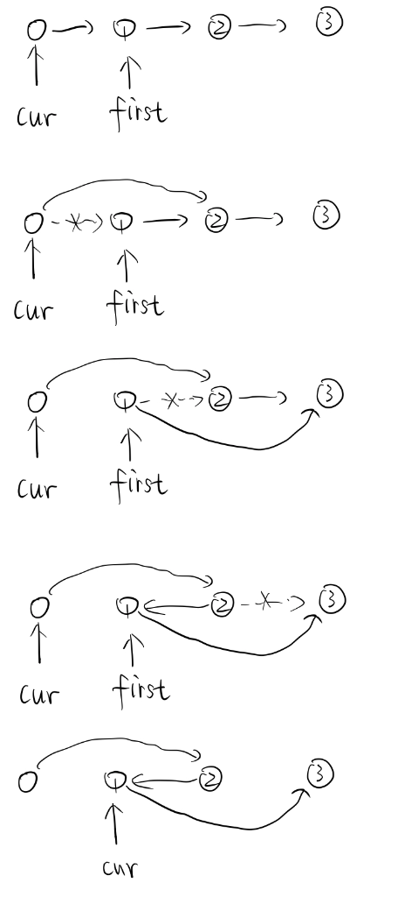

#### 24. Swap Nodes in Pairs

> Given a linked list, swap every two adjacent nodes and return its head.
>
> You may **not** modify the values in the list's nodes, only nodes itself may be changed.
>
> 
>
> **Example:**
>
> ```
> Given 1->2->3->4, you should return the list as 2->1->4->3.
> ```

```c++
ListNode* swapPairs(ListNode* head) {
        ListNode* dummy = new ListNode(0);
        dummy->next = head;
        ListNode* cur = dummy;
        while(cur->next && cur->next->next){
            ListNode *first = cur->next;
            cur->next = first->next;
            first->next = first->next->next;
            cur->next->next = first;
            cur = first;
        }
        return dummy->next;
    }
```



