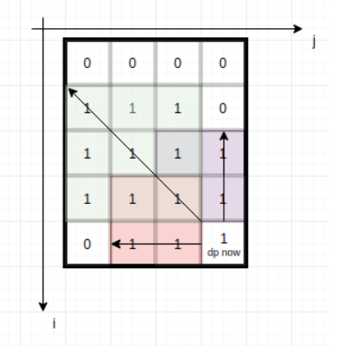

> Given a `m * n` matrix of ones and zeros, return how many **square** submatrices have all ones.
>
>  
>
> **Example 1:**
>
> ```
> Input: matrix =
> [
>   [0,1,1,1],
>   [1,1,1,1],
>   [0,1,1,1]
> ]
> Output: 15
> Explanation: 
> There are 10 squares of side 1.
> There are 4 squares of side 2.
> There is  1 square of side 3.
> Total number of squares = 10 + 4 + 1 = 15.
> ```
>
> **Example 2:**
>
> ```
> Input: matrix = 
> [
>   [1,0,1],
>   [1,1,0],
>   [1,1,0]
> ]
> Output: 7
> Explanation: 
> There are 6 squares of side 1.  
> There is 1 square of side 2. 
> Total number of squares = 6 + 1 = 7.
> ```
>
>  
>
> **Constraints:**
>
> - `1 <= arr.length <= 300`
> - `1 <= arr[0].length <= 300`
> - `0 <= arr[i][j] <= 1`

```cpp
class Solution {
public:
    int countSquares(vector<vector<int>>& matrix) {
        int m = matrix.size();
        if(!m) return 0;
        int n = matrix[0].size();
        if(!n) return 0;
        vector<vector<int>> dp(m+1, vector<int>(n+1,0));
        for(int i=1;i<=m;++i){
            for(int j=1;j<=n;++j){
                if(matrix[i-1][j-1] == 0) continue;
                int len = dp[i-1][j-1];
                len = min(len, dp[i-1][j]);
                len = min(len, dp[i][j-1]);
                dp[i][j] = len+1;
            }
        }
        int ans = 0;
        for(int i=1;i<=m;++i){
            for(int j=1;j<=n;++j){
                ans += dp[i][j];
            }
        }
        return ans;
    }
};
```



the max len of square where matrix\[i\]\[j\] is the right-bottom point.

its len is controled by dp\[i\]\[j\] and dp\[i-1\]\[j\]  dp\[i\]\[j-1\] （对角线，竖线，横线）