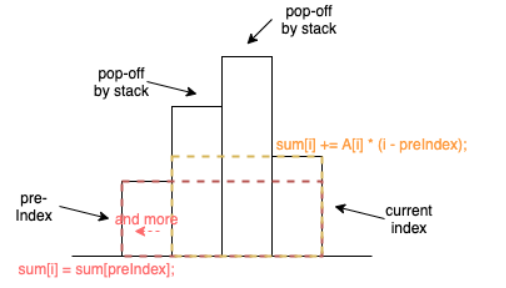

> Given a `rows * columns` matrix `mat` of ones and zeros, return how many **submatrices** have all ones.
>
>  
>
> **Example 1:**
>
> ```
> Input: mat = [[1,0,1],
>               [1,1,0],
>               [1,1,0]]
> Output: 13
> Explanation:
> There are 6 rectangles of side 1x1.
> There are 2 rectangles of side 1x2.
> There are 3 rectangles of side 2x1.
> There is 1 rectangle of side 2x2. 
> There is 1 rectangle of side 3x1.
> Total number of rectangles = 6 + 2 + 3 + 1 + 1 = 13.
> ```
>
> **Example 2:**
>
> ```
> Input: mat = [[0,1,1,0],
>               [0,1,1,1],
>               [1,1,1,0]]
> Output: 24
> Explanation:
> There are 8 rectangles of side 1x1.
> There are 5 rectangles of side 1x2.
> There are 2 rectangles of side 1x3. 
> There are 4 rectangles of side 2x1.
> There are 2 rectangles of side 2x2. 
> There are 2 rectangles of side 3x1. 
> There is 1 rectangle of side 3x2. 
> Total number of rectangles = 8 + 5 + 2 + 4 + 2 + 2 + 1 = 24.
> ```
>
> **Example 3:**
>
> ```
> Input: mat = [[1,1,1,1,1,1]]
> Output: 21
> ```
>
> **Example 4:**
>
> ```
> Input: mat = [[1,0,1],[0,1,0],[1,0,1]]
> Output: 5
> ```
>
>  
>
> **Constraints:**
>
> - `1 <= rows <= 150`
> - `1 <= columns <= 150`
> - `0 <= mat[i][j] <= 1`

```cpp
class Solution {
public:
    int numSubmat(vector<vector<int>>& mat) {
        return n3(mat);
    }
    int n3(vector<vector<int>>& mat){
        int m = mat.size();
        if(!m) return 0;
        int n = mat[0].size();
        if(!n) return 0;
        vector<vector<int>> lefts(m, vector<int>(n, 0));
        for(int i=0;i<m;++i){
            for(int j=0;j<n;++j){
                if(mat[i][j] == 0) continue;
                if(j==0){
                    lefts[i][j] = mat[i][j];
                }else{
                    lefts[i][j] = lefts[i][j-1] + 1;
                }
            }
        }
        int ans = 0;
        for(int i=0;i<m;++i){
            for(int j=0;j<n;++j){
                if(mat[i][j] == 0) continue;
                int width = lefts[i][j];
                // calculate matrix of height=1, height=2, height=3..
                for(int k=0;i-k>=0 && lefts[i-k][j]>0;++k){
                    width = min(width, lefts[i-k][j]);
                    ans += width;
                }
            }
        }
        return ans;
    }
    int n2(vector<vector<int>>& mat){
        int m = mat.size();
        if(!m) return 0;
        int n = mat[0].size();
        if(!n) return 0;
        vector<vector<int>> height;
        
        height[0] = mat[0];
        int ans = 0;
        for(int i=1;i<m;++i){
            stack<int> stk;
            vector<int> sums(n,0);
            for(int j=0;j<n;++j){
                int sum = 0;
                height[i][j] = (mat[i][j] == 1)?(height[i-1][j] + 1):(0);
                while(!stk.empty() && height[i][j] <= height[i][stk.top()]) stk.pop();
                if(stk.empty()){
                    sum = height[i][j]*(j+1);
                }else{
                    sum += sums[stk.top()];
                    sum += (j - stk.top())*(height[i][j]);
                }
                ans += sum;
                sums[j] = sum;
                stk.push(j);
            }
        }
        return ans;
        
    }
};
```

On2 Solution using a increasing mono-stack;



对于某个index=i，假设左侧第一个高度小于它的index=j。

那么以i处为右下角的矩形数为=

所有以j处为右下角的矩形数「因为这所有矩形都可以延伸到i处」+

（i-j）*（height[i]）。「中间部分，高度可为1，2，3，。。。height[i]，宽度可为1, 2,3 ... (j-i)」